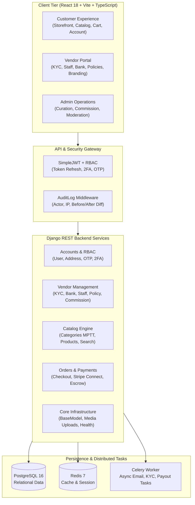

<div align="center">

# 🛍️ LuxeLane
### *The Quintessential Luxury Multi-Vendor E-Commerce Platform*

[](https://www.djangoproject.com/)
[](https://www.django-rest-framework.org/)
[](https://reactjs.org/)
[](https://www.typescriptlang.org/)
[](https://www.postgresql.org/)
[](https://redis.io/)
[](https://docs.celeryq.dev/)
[](http://localhost:8000/api/schema/swagger-ui/)

<br />

<p align="center">
  <b>LuxeLane</b> is an enterprise-grade, high-fashion multi-vendor marketplace engine tailored for luxury retailers, premier artisans, and discerning clientele worldwide. Engineered with uncompromising security, multi-role granularity, automated merchant curation, and seamless scalability.
</p>

<p align="center">
  <a href="#-key-features">Key Features</a> •
  <a href="#-architecture">Architecture</a> •
  <a href="#-tech-stack">Tech Stack</a> •
  <a href="#-sprint-roadmap">Roadmap</a> •
  <a href="#-getting-started">Getting Started</a> •
  <a href="#-api-documentation">API Docs</a>
</p>

---

</div>

<br />

## ✨ Key Features

### 👑 Bespoke Multi-Role RBAC
* **Customers:** Curated catalog browsing, secure checkout, multi-address book, notifications feed, and an integrated *"Become a Vendor"* application flow.
* **Vendors (Merchants):** Comprehensive Merchant Portal with KYC compliance verification, encrypted/masked bank payout accounts, role-scoped team management (Manager, Support, Fulfillment), policy customization, and personalized public storefronts.
* **Platform Admins:** End-to-end merchant onboarding pipeline with approval/rejection workflows, document review, commission schedule management, user moderation, and immutable audit trails.

### 🛡️ Hardened Security & Identity
* **JWT Authentication:** SimpleJWT with secure access tokens and sliding token rotation.
* **OTP Verification:** Destination-based one-time passwords for email & SMS verification flows.
* **Two-Factor Authentication (2FA):** Native TOTP support with verify/enable cycles.
* **Data Protection:** Financial accounts stored with field-level encryption and strict masked outputs (`**** 1234`).
* **Audit Logging:** System-wide actor tracking capturing model changes, IP addresses, and state diffs (`before` / `after`).

### 🏛️ Automated Compliance & KYC
* Document uploads via presigned direct storage URLs (`business_registration`, `tax_certificate`, `id_proof`, `bank_statement`).
* Admin-curated document validation with structured feedback notes and automated vendor notification dispatches.

---

## 🏛️ Architecture



---

## 🛠️ Tech Stack

| Layer | Technologies |
|---|---|
| **Backend Framework** | Python 3.14 · Django 5.x · Django REST Framework (DRF) |
| **Authentication & RBAC** | `djangorestframework-simplejwt` · Custom Granular Role Permissions |
| **Database & Caching** | PostgreSQL 16 · Redis 7 (`django-redis`) |
| **Async Processing** | Celery 5.x with Redis message broker |
| **API Specification** | `drf-spectacular` (OpenAPI 3.0 + Swagger UI + Redoc) |
| **Frontend Framework** | React 18 · TypeScript · Vite · Tailwind CSS |
| **State & Networking** | Custom Typed Fetch Clients · Token Service with LocalStorage persistence |
| **Visuals & Charts** | Recharts · Custom Luxury SVG Icon System · Glassmorphic Design Tokens |

---

## 📊 Development Roadmap

| Sprint | Module | Scope | Status |
|:---:|---|---|:---:|
| **0** | **Foundations & Core** | Base models, Celery scaffolding, health & readiness checks (`/healthz/`, `/readyz/`) | ✅ **Complete** |
| **1** | **Identity & RBAC** | JWT Auth, OTP verification, password resets, 2FA, user moderation | ✅ **Complete** |
| **2** | **Profiles & Assets** | Multi-address management, presigned media uploads, notifications feed | ✅ **Complete** |
| **3** | **Vendors & Commission** | KYC verification, masked banking, staff access, policies, commission rules | ✅ **Complete** |
| **4** | **Catalog Core & Moderation** | MPTT categories, brand management, product curation pipeline | ⏳ *Next Sprint* |
| **5** | **Variants & Search** | SKU attributes, Cartesian variant generation, full-text faceted search | ⏳ *Pending* |
| **6** | **Warehouse & Inventory** | Stock movements, transfers, low-stock threshold triggers | ⏳ *Pending* |
| **7** | **Reservations & Routing** | TTL stock reservations, multi-node fulfillment routing | ⏳ *Pending* |
| **8** | **Cart, Pricing & Promos** | Dynamic pricing engine, coupon redemptions, cart reconciliation | ⏳ *Pending* |
| **9** | **Shipping & Packing** | Carrier integrations (EasyPost/Shippo), dimensional packing | ⏳ *Pending* |
| **10** | **Orders & Checkout** | Atomic checkout orchestration, stateful order lifecycle management | ⏳ *Pending* |
| **11** | **Payments & Webhooks** | Stripe Connect marketplace routing, idempotent webhook ingestion | ⏳ *Pending* |
| **12** | **Ledger & Escrow** | Double-entry ledger accounting, escrow releases, COD handling | ⏳ *Pending* |
| **13** | **Shipments & Tracking** | Automated shipping label generation, tracking webhooks | ⏳ *Pending* |
| **14** | **Returns, Refunds & Reviews**| Return RMA workflows, refund reconciliation, customer reviews | ⏳ *Pending* |
| **15** | **Payouts & Reporting** | Automated Stripe Connect vendor payouts, platform revenue analytics | ⏳ *Pending* |
| **16** | **Launch Hardening** | Penetration security audit, rate limiting, production observability | ⏳ *Pending* |

---

## 🚀 Getting Started

### Prerequisites
* **Python 3.11+**
* **Node.js 18+** & **npm**
* **PostgreSQL 16** & **Redis 7** (or Docker)

---

### 1. Backend Setup (Django)

```bash
# Navigate to backend directory
cd server

# Create and activate virtual environment
python -m venv venv
# On Windows:
.\venv\Scripts\activate
# On macOS/Linux:
# source venv/bin/activate

# Install dependencies
pip install -r requirements.txt

# Configure environment variables
cp .env.example .env

# Run database migrations
python manage.py migrate

# (Optional) Run backend automated test suite (47 unit tests)
python manage.py test

# Start the Django development server
python manage.py runserver
```

The API will be available at **`http://localhost:8000/api/v1/`**.  
Interactive Swagger documentation is available at **`http://localhost:8000/api/schema/swagger-ui/`**.

---

### 2. Frontend Setup (React + Vite)

```bash
# Navigate to frontend directory
cd client

# Install packages
npm install

# Start Vite development server with HMR
npm run dev
```

The application will launch at **`http://localhost:5173/`**.

---

## 📂 Repository Structure

```
luxelane/
├── client/                     # React 18 + TypeScript Frontend
│   ├── index.html              # HTML shell & font imports
│   ├── types.ts                # Shared TypeScript domain models
│   ├── services/
│   │   ├── api.ts              # Centralized API service & token manager
│   │   └── countryData.ts      # Global country & postal validation data
│   ├── components/             # Reusable UI icons & design tokens
│   └── views/
│       ├── LandingPage.tsx     # Hero landing presentation
│       ├── auth/               # Multi-step authentication & OTP modals
│       ├── customer/           # Customer pages, account book & storefront
│       ├── vendor/             # Full Vendor Merchant Dashboard
│       └── admin/              # Platform moderation & commission controls
│
├── server/                     # Django 5.x REST Backend
│   ├── manage.py               # Django CLI entrypoint
│   ├── config/                 # Settings, root URLs, Celery application
│   ├── core/                   # BaseModel, media services, health checks
│   ├── accounts/               # User identity, RBAC, address book, OTP
│   ├── notifications/          # In-app notifications & channel preferences
│   └── vendors/                # KYC, staff, banking, policies, commission rules
│
└── README.md                   # Project documentation
```

---

## 📖 API Documentation

Once the backend server is running, explore interactive API documentation:

| Endpoint | Tool | Description |
|---|---|---|
| `/api/schema/swagger-ui/` | **Swagger UI** | Live interactive API test console |
| `/api/schema/redoc/` | **Redoc** | Clean, searchable technical API reference |
| `/api/schema/` | **OpenAPI JSON/YAML**| Raw OpenAPI 3.0 specification |
| `/healthz/` | **Health Check** | Platform liveness probe |
| `/readyz/` | **Readiness Check** | Verifies database, cache & Celery status |

---

<div align="center">

### 💎 Crafted with Passion by the LuxeLane Engineering Team
*Elevating luxury digital commerce through modern software engineering.*

<br />

[](LICENSE)

</div>
