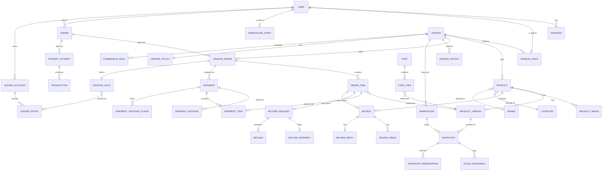

# Multi-Vendor E-Commerce Backend — Detailed Engineering Spec
**Version 3.0** · Extends "Development Plan v2.0 (Final)" with full **ERD, model fields, serializers, views, and URL-level API contracts** for every sprint. Nothing here contradicts v2.0 — it fills in the implementation layer that was previously left as prose.

**Stack:** Django 5.x + DRF · PostgreSQL 16 · Redis + Celery · SimpleJWT · Stripe Connect / Authorize.Net / COD · EasyPost or Shippo (DHL·UPS·USPS·FedEx) · drf-spectacular (OpenAPI)

---

## 0. Conventions (apply to every sprint below)

**Base URL:** `/api/v1/`
**Auth:** `Authorization: Bearer <access_token>` (SimpleJWT). Refresh via `/auth/token/refresh/`.
**Pagination:** cursor pagination on all list endpoints — `?cursor=...&page_size=...` (default 20, max 100). Response envelope:
```json
{ "results": [...], "next": "cursor-or-null", "previous": "cursor-or-null", "count": 1234 }
```
**Error envelope** (all 4xx/5xx):
```json
{ "error": { "code": "INVENTORY_INSUFFICIENT", "message": "...", "field_errors": {"qty": ["..."]}, "request_id": "..." } }
```
**Idempotency:** any POST that creates a financial/order side-effect accepts `Idempotency-Key` header (persisted in `IdempotencyKey`, TTL 24h).
**Versioning:** URL-path versioning (`/api/v1/`, `/api/v2/`... later). Field additions are non-breaking; removals bump version.
**Filtering/search:** `django-filter` `?field=value`, search via `?q=`, ordering via `?ordering=-created_at`.
**Every model** inherits `core.BaseModel`: `id (UUIDField, pk, default=uuid4)`, `created_at (DateTimeField, auto_now_add)`, `updated_at (DateTimeField, auto_now)`, `is_deleted (BooleanField, default=False)` (soft delete, catalog/user rows only — never on `LedgerEntry`, `StockMovement`, `Order*`, `Shipment*`, `Transaction`, `WebhookEvent`).
**Every list/detail endpoint** below requires the stated permission class in addition to `IsAuthenticated` unless marked **Public**.
**Naming:** ViewSets use DRF `GenericViewSet` + explicit mixins (never blanket `ModelViewSet` where an action shouldn't exist, e.g. no `DELETE` on `Order`). All business logic lives in `app/services.py`; views only validate + call services + serialize.

---

## 1. Entity Relationship Diagram (system-level)



Sub-diagrams for money flow (§7 Ledger) and inventory state (§8) are given as state tables further down since they are transaction graphs, not structural ERDs.

---

## 2. Full Entity / Attribute Reference

> Field notation: `name : type (constraints)`. FK notation: `→ Model.field`. All models also inherit the `BaseModel` fields from §0 (omitted below for brevity) unless marked *(no soft-delete)*.

### 2.1 `accounts`

**User** *(no soft-delete)*
| Field | Type | Notes |
|---|---|---|
| email | EmailField, unique, null=True | one of email/phone required |
| phone | CharField(20), unique, null=True | E.164 |
| password | CharField (Django auth hash) | |
| role | CharField, choices=RoleEnum | super_admin, platform_admin, finance_admin, vendor_owner, vendor_staff, warehouse_manager, warehouse_staff, delivery_agent, customer |
| first_name / last_name | CharField(100) | |
| is_verified | BooleanField, default=False | email/phone verified |
| is_active | BooleanField, default=True | admin can suspend |
| two_factor_enabled | BooleanField, default=False | |
| last_login_at | DateTimeField, null=True | |
| avatar_url | URLField, null=True | |

**Address**
| Field | Type | Notes |
|---|---|---|
| user | FK → User | |
| label | CharField(50) | "Home", "Office" |
| line1, line2 | CharField(255) | |
| city, state, country, postal_code | CharField | |
| latitude, longitude | DecimalField(9,6) | ADR-03 |
| type | CharField, choices=[shipping, billing, both] | |
| is_default | BooleanField | |
| contact_phone | CharField(20) | |

**OTPVerification**
| Field | Type | Notes |
|---|---|---|
| user | FK → User, null=True | null until account created (pre-register OTP) |
| destination | CharField | email or phone value |
| code_hash | CharField | never store plaintext |
| purpose | CharField, choices=[register, login, reset_password, change_phone] | |
| expires_at | DateTimeField | |
| attempts | IntegerField, default=0 | rate-limit / lockout after 5 |
| consumed_at | DateTimeField, null=True | single-use |

**SocialAccount**
| Field | Type | Notes |
|---|---|---|
| user | FK → User | |
| provider | CharField, choices=[google, facebook, apple] | |
| provider_uid | CharField, unique-together(provider) | |

**LedgerAccount** *(no soft-delete)*
| Field | Type | Notes |
|---|---|---|
| account_key | CharField, unique | e.g. `customer_wallet:{user_id}`, `vendor_escrow:{vendor_id}` |
| account_type | CharField, choices=[platform_cash, platform_revenue_commission, vendor_escrow, vendor_payable, customer_wallet, gateway_fees, cod_receivable, refunds_payable] | |
| owner_user | FK → User, null=True | set for wallet accounts |
| owner_vendor | FK → Vendor, null=True | set for vendor accounts |
| currency | CharField(3), default="USD" | ADR-08 |

**LedgerEntry** *(no soft-delete, append-only, immutable)*
| Field | Type | Notes |
|---|---|---|
| account | FK → LedgerAccount | |
| amount | DecimalField(14,2) | signed; DR positive / CR negative convention |
| entry_group_id | UUIDField | groups the balanced pair/set from one economic event |
| reference_type | CharField | "order_capture","escrow_release","payout","refund","cod_settlement" |
| reference_id | UUIDField | polymorphic pointer to Order/VendorOrder/Payout/etc |
| memo | CharField(255), null=True | |

---

### 2.2 `vendors`

**Vendor**
| Field | Type | Notes |
|---|---|---|
| owner_user | FK → User | |
| legal_name, display_name | CharField | |
| slug | SlugField, unique | |
| description | TextField | |
| logo_url, banner_url | URLField, null=True | |
| status | CharField, choices=[pending, under_review, approved, rejected, suspended] | |
| rejection_reason | TextField, null=True | |
| tax_id | CharField, null=True | |
| support_email, support_phone | CharField | |
| rating_avg | DecimalField(3,2), default=0 | denormalized, recomputed async |
| rating_count | IntegerField, default=0 | |

**VendorStaff**
| Field | Type | Notes |
|---|---|---|
| vendor | FK → Vendor | |
| user | FK → User | |
| staff_role | CharField, choices=[owner, manager, staff] | |
| is_active | BooleanField | |

**VendorDocument**
| Field | Type | Notes |
|---|---|---|
| vendor | FK → Vendor | |
| doc_type | CharField, choices=[business_license, tax_cert, id_proof, bank_proof] | |
| file_url | URLField | |
| status | CharField, choices=[pending, approved, rejected] | |
| reviewed_by | FK → User, null=True | |
| reviewed_at | DateTimeField, null=True | |

**VendorBankAccount**
| Field | Type | Notes |
|---|---|---|
| vendor | FK → Vendor | |
| account_holder_name | CharField | |
| account_number_encrypted | BinaryField | encrypted at rest, never returned in full (mask to last4) |
| bank_name, routing_number | CharField | |
| stripe_connect_account_id | CharField, null=True | ADR-01 |
| is_verified | BooleanField | |

**VendorPolicy** *(OneToOne → Vendor)*
| Field | Type | Notes |
|---|---|---|
| vendor | OneToOneField → Vendor | |
| return_window_days | IntegerField, default=7 | |
| restocking_fee_pct | DecimalField(5,2), default=0 | |
| handling_sla_hours | IntegerField, default=48 | |
| self_ship_allowed | BooleanField, default=False | |
| escrow_days | IntegerField, default=7 | overrides ADR-09 default |

**CommissionRule**
| Field | Type | Notes |
|---|---|---|
| scope | CharField, choices=[platform_default, category, vendor] | |
| vendor | FK → Vendor, null=True | set when scope=vendor |
| category | FK → catalog.Category, null=True | set when scope=category |
| commission_pct | DecimalField(5,2) | |
| effective_from, effective_to | DateTimeField, null=True | |

**VendorPayout**
| Field | Type | Notes |
|---|---|---|
| vendor | FK → Vendor | |
| period_start, period_end | DateField | |
| gross_amount, adjustments_total, net_amount | DecimalField(14,2) | |
| status | CharField, choices=[scheduled, processing, paid, failed] | |
| disbursed_at | DateTimeField, null=True | |
| external_transfer_id | CharField, null=True | Stripe transfer id / bank ref |

**PayoutLineItem**
| Field | Type | Notes |
|---|---|---|
| payout | FK → VendorPayout | |
| vendor_order | FK → orders.VendorOrder | |
| amount | DecimalField(12,2) | |

**PayoutAdjustment**
| Field | Type | Notes |
|---|---|---|
| vendor | FK → Vendor | |
| payout | FK → VendorPayout, null=True | attached at next payout run |
| amount | DecimalField(12,2) | negative = clawback |
| reason | CharField, choices=[post_release_refund, penalty, correction] | |
| source_reference_id | UUIDField, null=True | e.g. Refund id |

---

### 2.3 `catalog`

**Category** (MPTT: `django-mptt` adds `lft, rght, tree_id, level` automatically)
| Field | Type | Notes |
|---|---|---|
| parent | TreeForeignKey → self, null=True | |
| name | CharField(150) | |
| slug | SlugField, unique | |
| icon_url | URLField, null=True | |
| is_active | BooleanField | |

**Brand**
| Field | Type | Notes |
|---|---|---|
| name | CharField(150), unique | |
| slug | SlugField, unique | |
| logo_url | URLField, null=True | |

**Product**
| Field | Type | Notes |
|---|---|---|
| vendor | FK → Vendor | |
| category | FK → Category | |
| brand | FK → Brand, null=True | |
| title | CharField(255) | |
| slug | SlugField, unique | |
| description | TextField | |
| status | CharField, choices=[draft, pending_review, approved, rejected, archived] | |
| rejection_reason | TextField, null=True | |
| base_price | DecimalField(12,2) | fallback if no variants override |
| search_vector | SearchVectorField, null=True | GIN indexed, ADR-07 |
| rating_avg | DecimalField(3,2), default=0 | denormalized |
| rating_count | IntegerField, default=0 | |
| is_active | BooleanField | |

**ProductAttribute**
| Field | Type | Notes |
|---|---|---|
| name | CharField(100) | "Color", "Size" |
| category | FK → Category, null=True | scoping which categories use it |

**ProductAttributeValue**
| Field | Type | Notes |
|---|---|---|
| attribute | FK → ProductAttribute | |
| value | CharField(100) | "Red", "XL" |

**ProductVariant**
| Field | Type | Notes |
|---|---|---|
| product | FK → Product | |
| sku | CharField(64) | unique-together(vendor) via product.vendor |
| barcode | CharField(64), null=True | |
| price | DecimalField(12,2) | |
| compare_at_price | DecimalField(12,2), null=True | |
| weight_kg, length_cm, width_cm, height_cm | DecimalField | for dimensional weight (Sprint 9) |
| is_active | BooleanField | |

**ProductVariantAttribute**
| Field | Type | Notes |
|---|---|---|
| variant | FK → ProductVariant | |
| attribute_value | FK → ProductAttributeValue | |

**ProductImage**
| Field | Type | Notes |
|---|---|---|
| product | FK → Product | |
| variant | FK → ProductVariant, null=True | |
| image_url | URLField | |
| sort_order | IntegerField | |
| is_primary | BooleanField | |

**ProductTag** / **Wishlist**
| Field | Type | Notes |
|---|---|---|
| ProductTag.product | FK → Product | |
| ProductTag.tag | CharField(50) | |
| Wishlist.user | FK → User | |
| Wishlist.product | FK → Product | unique-together(user,product) |

**Review**
| Field | Type | Notes |
|---|---|---|
| product | FK → Product | |
| user | FK → User | |
| order_item | FK → orders.OrderItem, null=True | required non-null to publish (verified) |
| rating | IntegerField(1-5) | |
| title | CharField(150), null=True | |
| comment | TextField | |
| is_verified_purchase | BooleanField, default=False | auto-set from order_item.delivered |
| moderation_status | CharField, choices=[pending, approved, rejected] | |

**ReviewMedia**
| Field | Type | Notes |
|---|---|---|
| review | FK → Review | |
| media_url | URLField | |
| media_type | CharField, choices=[image, video] | |

**ReviewReply**
| Field | Type | Notes |
|---|---|---|
| review | OneToOneField → Review | |
| vendor_staff | FK → User | |
| comment | TextField | |

**ProductQuestion** / **ProductAnswer**
| Field | Type | Notes |
|---|---|---|
| ProductQuestion.product | FK → Product | |
| ProductQuestion.user | FK → User | |
| ProductQuestion.question | TextField | |
| ProductAnswer.question | FK → ProductQuestion | |
| ProductAnswer.answered_by | FK → User | vendor staff or platform |
| ProductAnswer.answer | TextField | |

---

### 2.4 `warehouse`

**Warehouse**
| Field | Type | Notes |
|---|---|---|
| vendor | FK → Vendor, null=True | ADR-11: null = platform-owned |
| name | CharField(150) | |
| address | FK → accounts.Address | |
| latitude, longitude | DecimalField(9,6) | denormalized copy for fast Haversine queries |
| service_radius_km | DecimalField(6,2) | |
| sla_hours | IntegerField | handling SLA |
| is_active | BooleanField | |

**WarehouseStaff**
| Field | Type | Notes |
|---|---|---|
| warehouse | FK → Warehouse | |
| user | FK → User | |
| staff_role | CharField, choices=[manager, staff] | |

**Inventory**
| Field | Type | Notes |
|---|---|---|
| warehouse | FK → Warehouse | |
| variant | FK → catalog.ProductVariant | unique-together(warehouse, variant) |
| on_hand | IntegerField, default=0 | never written directly outside services.stock |
| reserved_cache | IntegerField, default=0 | denormalized cache, reconciled nightly against InventoryReservation |
| reorder_threshold | IntegerField, default=0 | |

**StockMovement** *(no soft-delete, append-only)*
| Field | Type | Notes |
|---|---|---|
| inventory | FK → Inventory | |
| quantity_delta | IntegerField | signed |
| movement_type | CharField, choices=[po_receipt, reservation_consumed, return_restock, manual_adjustment, transfer_in, transfer_out] | |
| reason | TextField, null=True | required if manual_adjustment |
| reference_id | UUIDField, null=True | PO / Order / Transfer id |
| performed_by | FK → User, null=True | |

**StockTransfer**
| Field | Type | Notes |
|---|---|---|
| from_warehouse, to_warehouse | FK → Warehouse | |
| status | CharField, choices=[requested, approved, in_transit, completed, cancelled] | |
| requested_by, approved_by | FK → User, null=True | |

**StockTransferItem**
| Field | Type | Notes |
|---|---|---|
| transfer | FK → StockTransfer | |
| variant | FK → catalog.ProductVariant | |
| quantity | IntegerField | |

**PurchaseOrder** / **PurchaseOrderItem**
| Field | Type | Notes |
|---|---|---|
| PurchaseOrder.warehouse | FK → Warehouse | |
| PurchaseOrder.status | CharField, choices=[draft, ordered, partially_received, received, cancelled] | |
| PurchaseOrder.supplier_name | CharField | |
| PurchaseOrderItem.po | FK → PurchaseOrder | |
| PurchaseOrderItem.variant | FK → catalog.ProductVariant | |
| PurchaseOrderItem.qty_ordered, qty_received | IntegerField | |
| PurchaseOrderItem.unit_cost | DecimalField(12,2) | |

**InventoryReservation**
| Field | Type | Notes |
|---|---|---|
| inventory | FK → Inventory | |
| cart_item | FK → cart_and_pricing.CartItem, null=True | |
| order_item | FK → orders.OrderItem, null=True | |
| quantity | IntegerField | |
| status | CharField, choices=[HELD, COMMITTED, RELEASED, EXPIRED] | |
| expires_at | DateTimeField | 15-min hold |

---

### 2.5 `cart_and_pricing`

**Cart**
| Field | Type | Notes |
|---|---|---|
| user | FK → User, null=True | null for guest |
| session_key | CharField(64), null=True | guest identity |
| status | CharField, choices=[active, converted, abandoned] | |
| applied_coupon | FK → Coupon, null=True | |

**CartItem**
| Field | Type | Notes |
|---|---|---|
| cart | FK → Cart | |
| variant | FK → catalog.ProductVariant | |
| quantity | IntegerField | |
| price_snapshot | DecimalField(12,2) | price at add-time, staleness checked at validate |

**Coupon**
| Field | Type | Notes |
|---|---|---|
| code | CharField(30), unique | |
| discount_type | CharField, choices=[percent, fixed] | |
| discount_value | DecimalField(12,2) | |
| scope | CharField, choices=[all, category, product, vendor] | |
| scope_target_id | UUIDField, null=True | |
| min_cart_value | DecimalField(12,2), null=True | |
| usage_limit_total, usage_limit_per_user | IntegerField, null=True | |
| valid_from, valid_to | DateTimeField | |
| is_active | BooleanField | |

**CouponUsage**
| Field | Type | Notes |
|---|---|---|
| coupon | FK → Coupon | |
| user | FK → User | |
| order | FK → orders.Order, null=True | |

**TaxRate** / **TaxRule**
| Field | Type | Notes |
|---|---|---|
| TaxRate.country, state | CharField | |
| TaxRate.rate_pct | DecimalField(5,2) | |
| TaxRule.category | FK → catalog.Category, null=True | category-specific override |
| TaxRule.tax_rate | FK → TaxRate | |

---

### 2.6 `orders`

**Order**
| Field | Type | Notes |
|---|---|---|
| customer | FK → User | |
| order_number | CharField, unique | human-readable, e.g. `ORD-100234` |
| shipping_address | FK → accounts.Address | snapshot copy fields also stored (immutability) |
| billing_address | FK → accounts.Address | |
| currency | CharField(3) | |
| subtotal, discount_total, shipping_total, tax_total, grand_total | DecimalField(12,2) | |
| status | CharField, choices=[pending_payment, confirmed, partially_shipped, shipped, partially_delivered, delivered, cancelled, refunded] | |
| placed_at | DateTimeField | |
| coupon | FK → cart_and_pricing.Coupon, null=True | |
| is_guest_order | BooleanField | |

**VendorOrder**
| Field | Type | Notes |
|---|---|---|
| order | FK → Order | |
| vendor | FK → Vendor | |
| subtotal, shipping_amount, commission_amount, vendor_net_amount | DecimalField(12,2) | commission frozen at capture time |
| status | CharField, choices=[pending, confirmed, packed, shipped, delivered, cancelled, return_requested, refunded] | |
| escrow_hold | FK → payments.EscrowHold, null=True | |
| commission_pct_applied | DecimalField(5,2) | audit trail even though CommissionRule may change later |

**OrderItem**
| Field | Type | Notes |
|---|---|---|
| vendor_order | FK → VendorOrder | |
| variant | FK → catalog.ProductVariant | |
| warehouse | FK → warehouse.Warehouse | allocated warehouse |
| quantity | IntegerField | |
| unit_price | DecimalField(12,2) | |
| fulfilment_status | CharField, choices=[pending, allocated, packed, shipped, delivered, cancelled, returned] | |

**OrderStatusHistory**
| Field | Type | Notes |
|---|---|---|
| order | FK → Order | |
| vendor_order | FK → VendorOrder, null=True | |
| from_status, to_status | CharField | |
| changed_by | FK → User, null=True | null = system |
| note | TextField, null=True | |

**Cancellation**
| Field | Type | Notes |
|---|---|---|
| order_item | FK → OrderItem | |
| reason | TextField | |
| cancelled_by | FK → User | |
| refund | FK → payments.Refund, null=True | |

**Invoice**
| Field | Type | Notes |
|---|---|---|
| order | FK → Order | |
| pdf_url | URLField | |
| invoice_number | CharField, unique | |

**IdempotencyKey** *(no soft-delete)*
| Field | Type | Notes |
|---|---|---|
| key | CharField, unique | client-supplied header value |
| user | FK → User, null=True | |
| endpoint | CharField | |
| response_snapshot | JSONField | replayed on duplicate |
| expires_at | DateTimeField | 24h TTL |

**OutboxEvent** *(no soft-delete)*
| Field | Type | Notes |
|---|---|---|
| event_type | CharField | "order.placed","vendor_order.shipped", etc |
| payload | JSONField | |
| status | CharField, choices=[pending, published, failed] | |
| published_at | DateTimeField, null=True | |
| retry_count | IntegerField, default=0 | |

---

### 2.7 `payments`

**PaymentAttempt**
| Field | Type | Notes |
|---|---|---|
| order | FK → orders.Order | |
| gateway | CharField, choices=[stripe, authorize_net, fake, cod] | |
| amount | DecimalField(12,2) | |
| status | CharField, choices=[initiated, requires_action, succeeded, failed, cancelled] | |
| client_secret | CharField, null=True | Stripe PI client secret |

**Transaction** *(no soft-delete)*
| Field | Type | Notes |
|---|---|---|
| payment_attempt | FK → PaymentAttempt | |
| gateway_transaction_id | CharField | |
| type | CharField, choices=[authorization, capture, refund, void] | |
| amount | DecimalField(12,2) | |
| status | CharField, choices=[pending, succeeded, failed] | |
| raw_response | JSONField | |

**SavedCard**
| Field | Type | Notes |
|---|---|---|
| user | FK → User | |
| gateway | CharField | |
| gateway_payment_method_id | CharField | |
| brand | CharField(20) | |
| last4 | CharField(4) | |
| exp_month, exp_year | IntegerField | |
| is_default | BooleanField | |

**WebhookEvent** *(no soft-delete)*
| Field | Type | Notes |
|---|---|---|
| source | CharField, choices=[stripe, authorize_net, easypost/shippo, carrier_dhl, carrier_ups, carrier_usps, carrier_fedex] | |
| provider_event_id | CharField, unique | dedupe key |
| raw_payload | JSONField | |
| status | CharField, choices=[received, processed, failed] | |
| processed_at | DateTimeField, null=True | |
| replay_count | IntegerField, default=0 | |

**EscrowHold**
| Field | Type | Notes |
|---|---|---|
| vendor_order | OneToOneField → orders.VendorOrder | |
| amount | DecimalField(12,2) | |
| status | CharField, choices=[held, released, clawed_back] | |
| release_scheduled_at | DateTimeField, null=True | delivery + escrow_days |
| released_at | DateTimeField, null=True | |
| frozen_by_rma | FK → orders.RMA (ReturnRequest), null=True | |

**WalletTransaction** *(read-only DB view over LedgerEntry filtered to customer_wallet accounts — not a writable table)*

**CODCollection**
| Field | Type | Notes |
|---|---|---|
| vendor_order | FK → orders.VendorOrder | |
| agent | FK → User | delivery_agent role |
| amount_expected, amount_collected | DecimalField(12,2) | |
| otp_verified | BooleanField | |
| collected_at | DateTimeField, null=True | |
| deposit_batch_id | CharField, null=True | |
| short_collection_reason | TextField, null=True | |

**Refund**
| Field | Type | Notes |
|---|---|---|
| order | FK → orders.Order | |
| order_item | FK → orders.OrderItem, null=True | partial refund |
| amount | DecimalField(12,2) | |
| method | CharField, choices=[wallet, original_payment, bank_cod] | |
| status | CharField, choices=[pending, completed, failed] | |
| ledger_entry_group_id | UUIDField | |

---

### 2.8 `shipping`

**Carrier**
| Field | Type | Notes |
|---|---|---|
| code | CharField, choices=[dhl, ups, usps, fedex, vendor_self] | |
| name | CharField | |
| is_active | BooleanField | |

**CarrierCredential**
| Field | Type | Notes |
|---|---|---|
| carrier | FK → Carrier | |
| vendor | FK → vendors.Vendor, null=True | per-vendor override |
| credentials_encrypted | BinaryField | |

**ShippingZone** / **ShippingRateCard**
| Field | Type | Notes |
|---|---|---|
| ShippingZone.name, countries (ArrayField/JSONField) | | |
| ShippingRateCard.zone | FK → ShippingZone | |
| ShippingRateCard.vendor | FK → Vendor, null=True | flat-rate self-ship option |
| ShippingRateCard.base_rate, per_kg_rate | DecimalField(10,2) | |

**RateQuote**
| Field | Type | Notes |
|---|---|---|
| cart_or_order_ref | UUIDField | |
| carrier | FK → Carrier | |
| service_level | CharField | "ground","express" |
| amount | DecimalField(10,2) | |
| quote_id | CharField, unique | external aggregator quote id |
| expires_at | DateTimeField | TTL, redeemed at label purchase |
| redeemed | BooleanField, default=False | |

**Shipment**
| Field | Type | Notes |
|---|---|---|
| vendor_order | FK → orders.VendorOrder | |
| carrier | FK → Carrier, null=True | null for self-ship pending entry |
| rate_quote | FK → RateQuote, null=True | |
| tracking_number | CharField, null=True | |
| label_url | URLField, null=True | |
| status | CharField, choices=[label_pending, label_purchased, in_transit, out_for_delivery, delivered, exception, cancelled, self_ship_manual] | |
| shipped_at, delivered_at | DateTimeField, null=True | |

**ShipmentPackage**
| Field | Type | Notes |
|---|---|---|
| shipment | FK → Shipment | |
| weight_kg | DecimalField(8,3) | dimensional weight computed at packing |
| length_cm, width_cm, height_cm | DecimalField(8,2) | |

**ShipmentItem**
| Field | Type | Notes |
|---|---|---|
| shipment | FK → Shipment | |
| order_item | FK → orders.OrderItem | |
| package | FK → ShipmentPackage, null=True | |
| quantity | IntegerField | |

**ShipmentTrackingEvent** *(no soft-delete, append-only)*
| Field | Type | Notes |
|---|---|---|
| shipment | FK → Shipment | |
| status_code | CharField | normalized vocabulary |
| description | CharField | |
| occurred_at | DateTimeField | |
| source | CharField, choices=[webhook, poll] | |

**ReturnRequest (RMA)**
| Field | Type | Notes |
|---|---|---|
| order_item | FK → orders.OrderItem | |
| user | FK → User | |
| reason | CharField | |
| evidence_media | JSONField | list of urls |
| status | CharField, choices=[requested, approved, rejected, item_received, restocked, written_off, closed] | |
| requested_at | DateTimeField | |

**ReturnShipment**
| Field | Type | Notes |
|---|---|---|
| return_request | FK → ReturnRequest | |
| carrier, tracking_number, label_url | same shape as Shipment (subset) | |

---

### 2.9 `notifications`

**Notification**
| Field | Type | Notes |
|---|---|---|
| user | FK → User | |
| channel | CharField, choices=[email, sms, push, in_app] | |
| template_code | CharField | |
| payload | JSONField | |
| status | CharField, choices=[queued, sent, failed, read] | |
| sent_at, read_at | DateTimeField, null=True | |

**NotificationTemplate**
| Field | Type | Notes |
|---|---|---|
| code | CharField, unique | "order_confirmed","otp_login" |
| channel | CharField | |
| subject | CharField, null=True | |
| body_template | TextField | |

**NotificationPreference**
| Field | Type | Notes |
|---|---|---|
| user | FK → User | |
| channel | CharField | |
| category | CharField | "marketing","transactional" |
| is_enabled | BooleanField | |

### 2.10 `core`

**BaseModel** — abstract, fields listed in §0.
**AuditLog** *(no soft-delete, append-only)*
| Field | Type | Notes |
|---|---|---|
| actor | FK → accounts.User, null=True | |
| action | CharField | "vendor.approved","product.rejected" |
| target_model, target_id | CharField / UUIDField | polymorphic |
| before, after | JSONField, null=True | diff snapshot |
| ip_address | GenericIPAddressField, null=True | |

**Setting**
| Field | Type | Notes |
|---|---|---|
| key | CharField, unique | |
| value | JSONField | |
| is_feature_flag | BooleanField | |

---

## 3. Roles → Object Permission Matrix (implementation reference)

| Role | Scope model | Key permission classes |
|---|---|---|
| super_admin | none (global) | `IsSuperAdmin` — bypasses all object checks |
| platform_admin | none (global) | `IsPlatformAdmin` |
| finance_admin | none (global, finance endpoints only) | `IsFinanceAdmin` — ledger, refunds, payouts, escrow |
| vendor_owner / vendor_staff | `VendorStaff` | `IsVendorMember` + `ScopedToVendorMixin` (queryset filtered to `vendor_id` from membership) |
| warehouse_manager / warehouse_staff | `WarehouseStaff` | `IsWarehouseMember` + `ScopedToWarehouseMixin` |
| delivery_agent | assigned CODCollection/Shipment | `IsAssignedDeliveryAgent` |
| customer | own rows only | `IsObjectOwner` (checks `obj.user_id == request.user.id` or `obj.customer_id`) |

`django-guardian` is explicitly **not** used (ADR per v2.0 §3) — coarse role + membership-table scoping only.

---

## 4. Sprint-by-Sprint Technical Spec

Each sprint below gives: **Models** (new/changed — see §2 for full field lists, only deltas or emphasis noted here), **Serializers**, **Views**, **URLs**. Business rules and Definition-of-Done stay as defined in v2.0 §8 — not repeated here except where an API detail depends on them.


### Sprint 0 — Foundations
No REST API surface (infra only). Two exceptions:

**Endpoints**
| Method | Path | View | Permission | Notes |
|---|---|---|---|---|
| GET | `/healthz/` | `HealthCheckView (APIView)` | Public | liveness |
| GET | `/readyz/` | `ReadinessCheckView (APIView)` | Public | checks DB/Redis/Celery |
| GET | `/api/v1/schema/` | drf-spectacular `SpectacularAPIView` | Public | OpenAPI schema |
| GET | `/api/v1/docs/` | `SpectacularSwaggerView` | Public | Swagger UI |

`payments.gateways.FakeGateway` and `shipping.carriers.FakeCarrier` are plain service classes (no endpoints), used internally by Sprint 10/9 views when `settings.PAYMENT_GATEWAY=='fake'`.

---

### Sprint 1 — Identity & RBAC

**Models:** `User`, `OTPVerification`, `SocialAccount`

**Serializers**
- `UserRegisterSerializer` — `email, phone, password, first_name, last_name` (write-only password, validates one of email/phone)
- `VendorRegisterSerializer` — extends above + `vendor.legal_name, display_name` (creates `User(role=vendor_owner)` + `Vendor(status=pending)` in one transaction)
- `LoginSerializer` — `email_or_phone, password`
- `TokenRefreshSerializer` — (SimpleJWT default, extended to check blacklist)
- `OTPRequestSerializer` — `destination, purpose`
- `OTPVerifySerializer` — `destination, code, purpose`
- `PasswordForgotSerializer` — `email_or_phone`
- `PasswordResetSerializer` — `token, new_password`
- `PasswordChangeSerializer` — `old_password, new_password`
- `TwoFactorEnableSerializer` / `TwoFactorVerifySerializer`
- `UserMeSerializer` — read/update profile subset (no role/email change here)
- `AdminUserSerializer` — full fields incl. `role, is_active` for admin list/detail
- `AdminUserStatusUpdateSerializer` — `is_active, reason`

**Views**
- `RegisterView (CreateAPIView)` — Public
- `VendorRegisterView (CreateAPIView)` — Public
- `LoginView (APIView.post)` — Public — issues access+refresh, throttled `AnonRateThrottle` (5/min)
- `TokenRefreshView` (SimpleJWT, with rotation + blacklist)
- `TokenVerifyView` (SimpleJWT default)
- `LogoutView (APIView.post)` — `IsAuthenticated` — blacklists refresh token
- `OTPRequestView (APIView.post)` — Public — rate-limited per destination
- `OTPVerifyView (APIView.post)` — Public — marks `OTPVerification.consumed_at`, activates user if purpose=register
- `OTPResendView (APIView.post)` — Public — enforces cooldown
- `PasswordForgotView / PasswordResetView / PasswordChangeView (APIView.post)`
- `TwoFactorEnableView / TwoFactorVerifyView (APIView.post)` — `IsAuthenticated`
- `UserMeView (RetrieveUpdateAPIView)` — `IsAuthenticated`
- `AdminUserViewSet (ListModelMixin, RetrieveModelMixin, GenericViewSet)` — `IsPlatformAdmin`
- `AdminUserStatusUpdateView (APIView.patch)` — `IsPlatformAdmin` — writes `AuditLog`

**URLs**
| Method | Path | View | Permission |
|---|---|---|---|
| POST | `/auth/register/` | RegisterView | Public |
| POST | `/auth/register/vendor/` | VendorRegisterView | Public |
| POST | `/auth/login/` | LoginView | Public |
| POST | `/auth/token/refresh/` | TokenRefreshView | Public |
| POST | `/auth/token/verify/` | TokenVerifyView | Public |
| POST | `/auth/logout/` | LogoutView | Authenticated |
| POST | `/auth/verify-otp/` | OTPVerifyView | Public |
| POST | `/auth/resend-otp/` | OTPResendView | Public |
| POST | `/auth/password/forgot/` | PasswordForgotView | Public |
| POST | `/auth/password/reset/` | PasswordResetView | Public |
| POST | `/auth/password/change/` | PasswordChangeView | Authenticated |
| POST | `/auth/2fa/enable/` | TwoFactorEnableView | Authenticated |
| POST | `/auth/2fa/verify/` | TwoFactorVerifyView | Authenticated |
| GET/PATCH | `/users/me/` | UserMeView | Authenticated |
| GET | `/admin/users/` | AdminUserViewSet.list | PlatformAdmin |
| GET | `/admin/users/{id}/` | AdminUserViewSet.retrieve | PlatformAdmin |
| PATCH | `/admin/users/{id}/status/` | AdminUserStatusUpdateView | PlatformAdmin |

---

### Sprint 2 — Profiles, Addresses, Media, Audit, Notification Core

**Models:** `Address`, `AuditLog`, `Notification`, `NotificationTemplate`, `NotificationPreference`

**Serializers**
- `AddressSerializer` — full CRUD fields; `validate()` enforces exactly one `is_default` per (user,type)
- `AddressValidateSerializer` — input: raw address text/components → output: normalized + lat/lng (calls geocoding adapter)
- `PresignedUploadRequestSerializer` — `content_type, size_bytes, purpose` → returns `upload_url, file_url, expires_at`
- `NotificationSerializer` — read-only list fields
- `NotificationPreferenceSerializer` — `channel, category, is_enabled`

**Views**
- `AddressViewSet (ModelViewSet)` — `IsObjectOwner`, queryset filtered to `request.user`
- `AddressValidateView (APIView.post)` — `IsAuthenticated`
- `MediaPresignedUploadView (APIView.post)` — `IsAuthenticated` — generates S3/MinIO presigned PUT
- `NotificationViewSet (ListModelMixin, GenericViewSet)` + `mark_read` action — `IsObjectOwner`
- `NotificationPreferenceViewSet (ListModelMixin, UpdateModelMixin, GenericViewSet)` — `IsObjectOwner`

`AuditLog` has no user-facing endpoints in this sprint — written via middleware (`core.middleware.AuditLogMiddleware`) hooking admin-role mutating requests; exposed later in Sprint 15 admin reporting.

**URLs**
| Method | Path | View | Permission |
|---|---|---|---|
| GET/POST | `/users/me/addresses/` | AddressViewSet.list/create | Owner |
| GET/PUT/PATCH/DELETE | `/users/me/addresses/{id}/` | AddressViewSet | Owner |
| POST | `/addresses/validate/` | AddressValidateView | Authenticated |
| POST | `/media/presigned-upload/` | MediaPresignedUploadView | Authenticated |
| GET | `/notifications/` | NotificationViewSet.list | Owner |
| POST | `/notifications/{id}/read/` | NotificationViewSet.mark_read | Owner |
| GET/PUT | `/notifications/preferences/` | NotificationPreferenceViewSet | Owner |

---

### Sprint 3 — Vendors, KYC, Staff, Commission

**Models:** `Vendor`, `VendorStaff`, `VendorDocument`, `VendorBankAccount`, `VendorPolicy`, `CommissionRule`

**Serializers**
- `VendorApplicationSerializer` — write: `legal_name, display_name, description, tax_id, support_email/phone`
- `VendorMeSerializer` — read/update own vendor profile (status read-only)
- `VendorStorefrontSerializer` — public subset: `display_name, slug, logo_url, banner_url, description, rating_avg`
- `VendorStaffSerializer` — `user, staff_role, is_active`
- `VendorDocumentSerializer` — `doc_type, file_url, status (read-only)`
- `VendorBankAccountSerializer` — write accepts full number, `to_representation` masks to `**** last4`
- `VendorPolicySerializer` — full fields, `IsVendorMember(owner/manager)` for write
- `CommissionRuleSerializer` — admin only; `AdminCommissionRuleSerializer`
- `AdminVendorSerializer` — full fields incl. internal notes
- `AdminVendorStatusSerializer` — `status, rejection_reason`

**Views**
- `VendorApplicationView (CreateAPIView)` — `IsAuthenticated` (role becomes vendor_owner + Vendor(pending) created)
- `VendorMeViewSet (RetrieveModelMixin, UpdateModelMixin, GenericViewSet)` — `IsVendorMember`
- `VendorStorefrontView (RetrieveAPIView)` — Public, lookup by slug
- `VendorStaffViewSet (ModelViewSet)` — `IsVendorMember(owner/manager)`, scoped to own vendor
- `VendorBankAccountViewSet (ModelViewSet)` — `IsVendorMember(owner)`
- `VendorDocumentViewSet (ListModelMixin, CreateModelMixin, GenericViewSet)` — `IsVendorMember`
- `VendorPolicyView (RetrieveUpdateAPIView)` — `IsVendorMember(owner/manager)`
- `AdminVendorViewSet (ModelViewSet, read + status actions only)` — `IsPlatformAdmin`
- `AdminVendorStatusUpdateView (APIView.patch)` — `IsPlatformAdmin` — writes AuditLog, triggers Stripe Connect account creation if approved (Celery task)
- `AdminVendorDocumentReviewView (APIView.patch)` — `IsPlatformAdmin`
- `AdminCommissionRuleViewSet (ModelViewSet)` — `IsPlatformAdmin`

**URLs**
| Method | Path | View | Permission |
|---|---|---|---|
| POST | `/vendors/apply/` | VendorApplicationView | Authenticated |
| GET/PATCH | `/vendors/me/` | VendorMeViewSet | VendorMember |
| GET | `/vendors/{slug}/storefront/` | VendorStorefrontView | Public |
| GET/POST | `/vendors/me/staff/` | VendorStaffViewSet.list/create | VendorMember(owner/mgr) |
| PUT/DELETE | `/vendors/me/staff/{id}/` | VendorStaffViewSet | VendorMember(owner/mgr) |
| GET/POST | `/vendors/me/bank-accounts/` | VendorBankAccountViewSet | VendorMember(owner) |
| GET/POST | `/vendors/me/documents/` | VendorDocumentViewSet | VendorMember |
| GET/PUT | `/vendors/me/policy/` | VendorPolicyView | VendorMember(owner/mgr) |
| GET | `/admin/vendors/` | AdminVendorViewSet.list | PlatformAdmin |
| GET | `/admin/vendors/{id}/` | AdminVendorViewSet.retrieve | PlatformAdmin |
| PATCH | `/admin/vendors/{id}/status/` | AdminVendorStatusUpdateView | PlatformAdmin |
| PATCH | `/admin/vendors/{vid}/documents/{id}/review/` | AdminVendorDocumentReviewView | PlatformAdmin |
| GET/POST | `/admin/commission-rules/` | AdminCommissionRuleViewSet | PlatformAdmin |
| PUT/DELETE | `/admin/commission-rules/{id}/` | AdminCommissionRuleViewSet | PlatformAdmin |

---

### Sprint 4 — Catalog Core & Moderation

**Models:** `Category`, `Brand`, `Product`, `ProductImage`, `ProductTag`

**Serializers**
- `CategorySerializer` — nested children via recursive field, `parent, name, slug, icon_url`
- `BrandSerializer`
- `ProductListSerializer` — lightweight: `id, title, slug, base_price, primary_image, vendor_display_name, rating_avg`
- `ProductDetailSerializer` — full incl. nested images/tags (variants added in Sprint 5)
- `ProductWriteSerializer` — vendor create/update, forces `status=pending_review` on submit
- `ProductImageSerializer` — `image_url, sort_order, is_primary`
- `AdminProductModerationSerializer` — `status, rejection_reason`
- `BulkImportRowResultSerializer` — read-only, returned in the async job result: `row_number, sku, status, errors`

**Views**
- `CategoryViewSet (ListModelMixin, RetrieveModelMixin, GenericViewSet)` — Public read; `IsPlatformAdmin` for write actions (separate `AdminCategoryViewSet (ModelViewSet)`)
- `BrandViewSet` — same pattern (`BrandViewSet` public read / `AdminBrandViewSet` admin write)
- `ProductViewSet (ModelViewSet)` — list/retrieve Public (filtered `status=approved,is_active=True`); create/update/destroy `IsVendorMember` scoped to own vendor + own-product check
- `VendorMyProductsViewSet (ModelViewSet)` — `IsVendorMember`, includes non-approved statuses, own vendor only
- `AdminProductModerationView (APIView.patch)` — `IsPlatformAdmin` — `approve` / `reject` actions, writes AuditLog + Notification to vendor
- `VendorProductBulkImportView (APIView.post)` — `IsVendorMember` — accepts CSV/XLSX, enqueues Celery task, returns `job_id`
- `BulkImportStatusView (RetrieveAPIView)` — `IsVendorMember` — poll job status + per-row report

**URLs**
| Method | Path | View | Permission |
|---|---|---|---|
| GET | `/categories/` | CategoryViewSet.list | Public |
| GET | `/categories/{id}/` | CategoryViewSet.retrieve | Public |
| POST/PUT/DELETE | `/admin/categories/` `/admin/categories/{id}/` | AdminCategoryViewSet | PlatformAdmin |
| GET | `/brands/` | BrandViewSet.list | Public |
| POST/PUT/DELETE | `/admin/brands/` `/admin/brands/{id}/` | AdminBrandViewSet | PlatformAdmin |
| GET | `/products/` | ProductViewSet.list | Public |
| GET | `/products/{id}/` | ProductViewSet.retrieve | Public |
| GET/POST | `/vendors/me/products/` | VendorMyProductsViewSet.list/create | VendorMember |
| GET/PUT/PATCH | `/vendors/me/products/{id}/` | VendorMyProductsViewSet | VendorMember(owner) |
| POST | `/vendors/me/products/bulk-import/` | VendorProductBulkImportView | VendorMember |
| GET | `/vendors/me/products/bulk-import/{job_id}/` | BulkImportStatusView | VendorMember |
| PATCH | `/admin/products/{id}/approve/` | AdminProductModerationView | PlatformAdmin |
| PATCH | `/admin/products/{id}/reject/` | AdminProductModerationView | PlatformAdmin |

---

### Sprint 5 — Variants, Attributes & Search

**Models:** `ProductAttribute`, `ProductAttributeValue`, `ProductVariant`, `ProductVariantAttribute`, `Wishlist`

**Serializers**
- `ProductAttributeSerializer` (nested `values`)
- `ProductVariantSerializer` — full fields + nested `attribute_values`
- `ProductVariantGenerateSerializer` — input: list of attribute-value id groups → generates cartesian product of variants server-side (service call, not raw create)
- `ProductSearchResultSerializer` — adds `facets` sibling structure at list-view level (not per-object)
- `WishlistSerializer` — `product` (nested lightweight)

**Views**
- `ProductVariantViewSet (ModelViewSet, nested under product)` — `IsVendorMember(owner of product.vendor)`
- `ProductAttributeViewSet (ModelViewSet)` — `IsPlatformAdmin` write / Public read
- `ProductSearchView (ListAPIView)` — Public — overrides `get_queryset` with `SearchVector` + `django-filter` `FilterSet` (category, brand, vendor, price_min/max, attributes, rating_min, in_stock) + facet aggregation (`annotate` + `Count` in one query, cached in Redis 60s)
- `ProductRelatedView (ListAPIView)` — Public — same category, excluding self, ordered by rating
- `WishlistViewSet (ListModelMixin, CreateModelMixin, DestroyModelMixin, GenericViewSet)` — `IsObjectOwner`

**URLs**
| Method | Path | View | Permission |
|---|---|---|---|
| GET/POST | `/products/{id}/variants/` | ProductVariantViewSet.list/create | Public read / VendorMember write |
| PUT/PATCH/DELETE | `/products/{pid}/variants/{id}/` | ProductVariantViewSet | VendorMember(owner) |
| POST | `/products/{id}/variants/generate/` | ProductVariantGenerateSerializer-backed view | VendorMember(owner) |
| GET | `/products/attributes/` | ProductAttributeViewSet.list | Public |
| POST/PUT/DELETE | `/products/attributes/` `/products/attributes/{id}/` | ProductAttributeViewSet | PlatformAdmin |
| GET | `/products/` (search/filter/facets) | ProductSearchView | Public |
| GET | `/products/{id}/related/` | ProductRelatedView | Public |
| GET/POST | `/wishlist/` | WishlistViewSet.list/create | Owner |
| DELETE | `/wishlist/{id}/` | WishlistViewSet.destroy | Owner |

---

### Sprint 6 — Warehouse & Inventory Core

**Models:** `Warehouse`, `WarehouseStaff`, `Inventory`, `StockMovement`, `StockTransfer`, `StockTransferItem`, `PurchaseOrder`, `PurchaseOrderItem`

**Serializers**
- `WarehouseSerializer` — full fields; write restricted per ADR-11 (`vendor` settable only by that vendor or platform_admin)
- `WarehouseStaffSerializer`
- `InventorySerializer` — read: `warehouse, variant, on_hand, reserved_cache, available (computed)`
- `InventoryAdjustSerializer` — write-only: `variant, warehouse, quantity_delta, reason` → calls `warehouse.services.stock.adjust()`
- `InventoryBulkUpdateSerializer` — list of the above, processed in one transaction
- `StockMovementSerializer` — read-only log
- `StockTransferSerializer` — nested `items`
- `StockTransferStatusSerializer` — `status` transition only
- `PurchaseOrderSerializer` — nested `items`
- `PurchaseOrderReceiveSerializer` — write: `items: [{item_id, qty_received}]` → posts StockMovement(po_receipt)
- `VariantAvailabilitySerializer` — read-only aggregate across warehouses: `variant_id, total_available, by_warehouse:[{warehouse_id, available}]`

**Views**
- `WarehouseViewSet (ModelViewSet)` — `IsWarehouseMember` or `IsVendorMember` (if vendor-owned) for write; Public read (name/city only) optional
- `WarehouseStaffViewSet (ModelViewSet, nested)` — `IsWarehouseMember(manager)`
- `WarehouseInventoryViewSet (ListModelMixin, GenericViewSet, nested under warehouse)` — `IsWarehouseMember`
- `InventoryAdjustView (APIView.post)` — `IsWarehouseMember` — routes through `services.stock.adjust()` only
- `InventoryBulkUpdateView (APIView.post)` — `IsWarehouseMember`
- `StockMovementViewSet (ListModelMixin, GenericViewSet)` — `IsWarehouseMember`, filterable by variant/date
- `StockTransferViewSet (ModelViewSet)` + `approve` / `complete` actions — `IsWarehouseMember(manager)` on origin/destination respectively
- `PurchaseOrderViewSet (ModelViewSet)` — `IsWarehouseMember`
- `PurchaseOrderReceiveView (APIView.post, nested)` — `IsWarehouseMember`
- `LowStockView (ListAPIView)` — `IsWarehouseMember` — filters `on_hand <= reorder_threshold`
- `VariantAvailabilityView (RetrieveAPIView)` — Public (or Authenticated) — used by PDP/cart

**URLs**
| Method | Path | View | Permission |
|---|---|---|---|
| GET/POST | `/warehouses/` | WarehouseViewSet.list/create | Public read / VendorMember or PlatformAdmin write |
| GET/PUT/DELETE | `/warehouses/{id}/` | WarehouseViewSet | WarehouseMember/owner |
| GET | `/warehouses/{id}/inventory/` | WarehouseInventoryViewSet.list | WarehouseMember |
| POST | `/inventory/adjust/` | InventoryAdjustView | WarehouseMember |
| POST | `/inventory/bulk-update/` | InventoryBulkUpdateView | WarehouseMember |
| GET | `/stock-movements/` | StockMovementViewSet.list | WarehouseMember |
| GET/POST | `/stock-transfers/` | StockTransferViewSet.list/create | WarehouseMember |
| PATCH | `/stock-transfers/{id}/approve/` | StockTransferViewSet.approve | WarehouseMember(mgr) |
| PATCH | `/stock-transfers/{id}/complete/` | StockTransferViewSet.complete | WarehouseMember(mgr) |
| GET/POST | `/purchase-orders/` | PurchaseOrderViewSet.list/create | WarehouseMember |
| GET/PUT | `/purchase-orders/{id}/` | PurchaseOrderViewSet | WarehouseMember |
| POST | `/purchase-orders/{id}/receive/` | PurchaseOrderReceiveView | WarehouseMember |
| GET | `/inventory/low-stock/` | LowStockView | WarehouseMember |
| GET | `/inventory/variant/{id}/availability/` | VariantAvailabilityView | Public |

---

### Sprint 7 — Reservations, Allocation & Smart Routing

**Models:** `InventoryReservation`

**Serializers**
- `AllocationPreviewRequestSerializer` — write: `items:[{variant_id, quantity}], shipping_address_id`
- `AllocationPreviewResponseSerializer` — read-only: `splits:[{warehouse_id, items:[...], distance_km}], total_splits, feasible (bool)`
- `InventoryReservationSerializer` — internal/read-only, exposed to admin only for debugging

**Views**
- `AllocationPreviewView (APIView.post)` — `IsAuthenticated` — calls `warehouse.services.allocation.preview()` (pure function, no writes)
- No other public endpoints this sprint — `reserve()/commit()/release()` are internal service functions called by Cart (Sprint 8) and Checkout (Sprint 10), not exposed directly.
- `ReservationSweeperTask (Celery beat, every 60s)` — releases expired `HELD` rows → `services.stock` StockMovement not needed (nothing was decremented from on_hand yet, only reserved_cache)
- `AdminInventoryReservationViewSet (ListModelMixin, GenericViewSet)` — `IsPlatformAdmin` — debugging/support tool

**URLs**
| Method | Path | View | Permission |
|---|---|---|---|
| POST | `/inventory/allocate/preview/` | AllocationPreviewView | Authenticated |
| GET | `/admin/inventory-reservations/` | AdminInventoryReservationViewSet.list | PlatformAdmin |

---

### Sprint 8 — Cart, Pricing & Promotions

**Models:** `Cart`, `CartItem`, `Coupon`, `CouponUsage`, `TaxRate`, `TaxRule`

**Serializers**
- `CartSerializer` — nested `items`, `applied_coupon`, computed `price_breakdown` (calls `pricing.calculate()`)
- `CartItemAddSerializer` — `variant_id, quantity`
- `CartItemUpdateSerializer` — `quantity`
- `CartMergeSerializer` — internal, triggered post-login (no request body — uses session cookie + auth user)
- `ApplyCouponSerializer` — `code`
- `CartValidateResponseSerializer` — `is_valid, issues:[{item_id, issue_type, message}]` (price_changed, out_of_stock, product_inactive)
- `CouponSerializer` (public validate subset) / `AdminCouponSerializer` (full, write)
- `TaxQuoteRequestSerializer` — `address_id, subtotal` → `TaxQuoteResponseSerializer` — `tax_amount, breakdown`

**Views**
- `CartView (RetrieveAPIView, get_or_create-by-session-or-user)` — Public/Authenticated (guest via session key header)
- `CartItemViewSet (CreateModelMixin, UpdateModelMixin, DestroyModelMixin, GenericViewSet, nested)` — Public/Authenticated (cart-owner check via session/user)
- `CartMergeView (APIView.post)` — `IsAuthenticated` — called right after login
- `CartApplyCouponView / CartRemoveCouponView (APIView.post/delete)` — Public/Authenticated
- `CartSummaryView (RetrieveAPIView)` — returns `PriceBreakdown` only (no item mutation)
- `CartValidateView (RetrieveAPIView)` — re-checks price_snapshot + stock before checkout
- `CouponViewSet (ListModelMixin, RetrieveModelMixin, GenericViewSet)` — Public (active coupons only, code hidden until validated)
- `CouponValidateView (APIView.post)` — Public/Authenticated — `code` → validity + discount preview without applying
- `AdminCouponViewSet (ModelViewSet)` — `IsPlatformAdmin`
- `TaxQuoteView (APIView.post)` — Public/Authenticated

**URLs**
| Method | Path | View | Permission |
|---|---|---|---|
| GET | `/cart/` | CartView | Public/Authenticated |
| POST | `/cart/items/` | CartItemViewSet.create | Public/Authenticated |
| PATCH/DELETE | `/cart/items/{id}/` | CartItemViewSet | Public/Authenticated (cart owner) |
| POST | `/cart/merge/` | CartMergeView | Authenticated |
| POST | `/cart/apply-coupon/` | CartApplyCouponView | Public/Authenticated |
| DELETE | `/cart/remove-coupon/` | CartRemoveCouponView | Public/Authenticated |
| GET | `/cart/summary/` | CartSummaryView | Public/Authenticated |
| GET | `/cart/validate/` | CartValidateView | Public/Authenticated |
| GET | `/coupons/` | CouponViewSet.list | Public |
| POST | `/coupons/validate/` | CouponValidateView | Public/Authenticated |
| GET/POST/PUT/DELETE | `/admin/coupons/` `/admin/coupons/{id}/` | AdminCouponViewSet | PlatformAdmin |
| POST | `/checkout/tax-quote/` | TaxQuoteView | Public/Authenticated |

---

### Sprint 9 — Shipping Rates & Packing

**Models:** `Carrier`, `CarrierCredential`, `ShippingZone`, `ShippingRateCard`, `RateQuote`

**Serializers**
- `CarrierSerializer` — read-only list (`code, name, is_active`)
- `AdminCarrierCredentialSerializer` — write-only credentials, masked on read
- `RateQuoteRequestSerializer` — `cart_id_or_items, shipping_address_id`
- `RateQuoteResponseSerializer` — list of `{carrier_code, service_level, amount, quote_id, expires_at}` incl. vendor flat-rate/self-ship options
- `ShippingRateCardSerializer` — admin/vendor write

**Views**
- `CarrierViewSet (ListModelMixin, GenericViewSet)` — Public
- `AdminCarrierCredentialViewSet (ModelViewSet)` — `IsPlatformAdmin` (or `IsVendorMember` for vendor-scoped credentials)
- `CheckoutRatesView (APIView.post)` — Public/Authenticated — calls `shipping.services.rates.get_quotes()`: fans out to EasyPost/Shippo adapter (2s timeout per carrier, parallel via `asyncio`/`concurrent.futures`) + vendor flat-rate cards; on carrier timeout, falls back to cached/flat rate and still returns 200; persists each returned option as a `RateQuote` row
- `ShippingRateCardViewSet (ModelViewSet)` — `IsVendorMember` (own) / `IsPlatformAdmin` (zone-wide)

**URLs**
| Method | Path | View | Permission |
|---|---|---|---|
| GET | `/shipping/carriers/` | CarrierViewSet.list | Public |
| GET/POST | `/admin/shipping/carrier-credentials/` | AdminCarrierCredentialViewSet | PlatformAdmin/VendorMember |
| POST | `/checkout/rates/` | CheckoutRatesView | Public/Authenticated |
| GET/POST/PUT | `/shipping/rate-cards/` | ShippingRateCardViewSet | VendorMember/PlatformAdmin |


### Sprint 10 — Orders & Checkout Orchestration

**Models:** `Order`, `VendorOrder`, `OrderItem`, `OrderStatusHistory`, `Cancellation`, `Invoice`, `IdempotencyKey`, `OutboxEvent`

**Serializers**
- `PlaceOrderSerializer` — write: `cart_id, shipping_address_id, billing_address_id, rate_quote_id, payment_method (fake/stripe/authorize_net/cod), coupon_code(optional)`
- `OrderListSerializer` — lightweight: `order_number, status, grand_total, placed_at, item_count`
- `OrderDetailSerializer` — nested `vendor_orders → order_items`, `status_history`, `shipping_address`
- `VendorOrderSerializer` (vendor-facing subset — hides other vendors' data on shared order)
- `OrderCancelSerializer` — `reason`
- `OrderItemCancelSerializer` — `reason`
- `InvoiceSerializer` — read-only `pdf_url, invoice_number`
- `OrderTrackSerializer` (public/guest lookup) — `order_number, email_or_phone` → status + tracking summary, no PII beyond what's needed

**Views**
- `PlaceOrderView (APIView.post)` — Public/Authenticated (guest per ADR-05); **the** orchestration endpoint:
  1. validate `Idempotency-Key` (return cached response on replay)
  2. re-validate cart (reuse `CartValidateView` logic)
  3. redeem `RateQuote` (must be unexpired, matches cart)
  4. recompute `PriceBreakdown` server-side — **never trust client totals**
  5. run allocation algorithm (Sprint 7) + `reserve()` inventory
  6. create `Order` → `VendorOrder`(s) → `OrderItem`(s) in one transaction
  7. create `PaymentAttempt` via selected gateway (`FakeGateway` until Sprint 11 wiring)
  8. write `OutboxEvent("order.placed")`
  9. on any failure after step 5, `release()` reservations and roll back
- `OrderViewSet (ListModelMixin, RetrieveModelMixin, GenericViewSet)` — `IsObjectOwner` (customer's own orders)
- `OrderCancelView (APIView.post)` — `IsObjectOwner` — only if no `VendorOrder` shipped yet; releases reservation, triggers refund flow if paid
- `OrderItemCancelView (APIView.post, nested)` — `IsObjectOwner` or `IsVendorMember` (vendor can cancel unfulfillable item)
- `InvoiceView (RetrieveAPIView)` — `IsObjectOwner` — serves generated PDF url (Celery-generated post-order)
- `OrderTrackView (APIView.post)` — Public — guest order lookup by order_number + email/phone
- `VendorMyOrdersViewSet (ListModelMixin, RetrieveModelMixin, GenericViewSet)` — `IsVendorMember`, returns `VendorOrder` rows scoped to vendor
- `WarehouseOrdersViewSet (ListModelMixin, GenericViewSet, nested under warehouse)` — `IsWarehouseMember` — `OrderItem`s allocated to that warehouse, for picking/packing queue
- `AdminOrderViewSet (ListModelMixin, RetrieveModelMixin, GenericViewSet)` — `IsPlatformAdmin` or `IsFinanceAdmin`

**URLs**
| Method | Path | View | Permission |
|---|---|---|---|
| POST | `/checkout/place-order/` | PlaceOrderView | Public/Authenticated |
| GET | `/orders/` | OrderViewSet.list | Owner |
| GET | `/orders/{id}/` | OrderViewSet.retrieve | Owner |
| POST | `/orders/{id}/cancel/` | OrderCancelView | Owner |
| POST | `/orders/{id}/items/{item_id}/cancel/` | OrderItemCancelView | Owner/VendorMember |
| GET | `/orders/{id}/invoice/` | InvoiceView | Owner |
| POST | `/orders/track/` | OrderTrackView | Public |
| GET | `/vendors/me/orders/` | VendorMyOrdersViewSet.list | VendorMember |
| GET | `/vendors/me/orders/{id}/` | VendorMyOrdersViewSet.retrieve | VendorMember |
| GET | `/warehouses/{id}/orders/` | WarehouseOrdersViewSet.list | WarehouseMember |
| GET | `/admin/orders/` | AdminOrderViewSet.list | PlatformAdmin/FinanceAdmin |
| GET | `/admin/orders/{id}/` | AdminOrderViewSet.retrieve | PlatformAdmin/FinanceAdmin |

---

### Sprint 11 — Online Payments & Webhooks

**Models:** `Transaction`, `PaymentAttempt` (activated), `SavedCard`, `WebhookEvent`

**Serializers**
- `PaymentMethodListSerializer` — read-only `SavedCard` list + available gateways
- `StripeCreateIntentSerializer` — `order_id` → returns `client_secret, payment_intent_id`
- `StripeConfirmSerializer` — `payment_intent_id`
- `AuthorizeNetChargeSerializer` — `order_id, opaque_data (Accept.js token)` (never raw PAN)
- `SavedCardSerializer` — read-only representation (`brand, last4, exp_month, exp_year, is_default`)
- `AdminTransactionSerializer` — read-only, `IsFinanceAdmin`
- `WebhookReplaySerializer` — internal, no request body, admin trigger only

**Views**
- `PaymentMethodsView (ListAPIView)` — `IsAuthenticated`
- `StripeCreatePaymentIntentView (APIView.post)` — `IsObjectOwner(order)` — calls Stripe SDK, creates `PaymentAttempt(status=requires_action)`
- `StripeConfirmPaymentView (APIView.post)` — `IsObjectOwner(order)`
- `StripeWebhookView (APIView.post)` — Public (signature-verified, not session-authenticated) — verify signature → store raw `WebhookEvent` → return 200 immediately → process async via Celery task → dedupe on `provider_event_id`
- `AuthorizeNetChargeView (APIView.post)` — `IsObjectOwner(order)`
- `AuthorizeNetWebhookView (APIView.post)` — Public, same pipeline shape as Stripe
- `SavedCardViewSet (ListModelMixin, DestroyModelMixin, GenericViewSet)` — `IsObjectOwner`
- `AdminTransactionViewSet (ListModelMixin, RetrieveModelMixin, GenericViewSet)` — `IsFinanceAdmin`
- `AdminWebhookReplayView (APIView.post)` — `IsPlatformAdmin` — re-enqueues processing for a stored `WebhookEvent`

Business logic note: successful payment webhook processing calls `orders.services.checkout.confirm_payment(order)` which commits reservations (`HELD → COMMITTED`) and transitions `Order.status → confirmed`; failure/timeout calls `release_reservations(order)`.

**URLs**
| Method | Path | View | Permission |
|---|---|---|---|
| GET | `/payments/methods/` | PaymentMethodsView | Authenticated |
| POST | `/payments/stripe/create-payment-intent/` | StripeCreatePaymentIntentView | Owner |
| POST | `/payments/stripe/confirm/` | StripeConfirmPaymentView | Owner |
| POST | `/payments/stripe/webhook/` | StripeWebhookView | Public (signed) |
| POST | `/payments/authorize-net/charge/` | AuthorizeNetChargeView | Owner |
| POST | `/payments/authorize-net/webhook/` | AuthorizeNetWebhookView | Public (signed) |
| GET/DELETE | `/payments/cards/` `/payments/cards/{id}/` | SavedCardViewSet | Owner |
| GET | `/admin/transactions/` | AdminTransactionViewSet.list | FinanceAdmin |
| POST | `/admin/webhooks/{id}/replay/` | AdminWebhookReplayView | PlatformAdmin |

---

### Sprint 12 — Ledger, Escrow, Wallet & COD

**Models:** `LedgerAccount`, `LedgerEntry`, `EscrowHold`, `CODCollection`

**Serializers**
- `WalletBalanceSerializer` — read-only, computed `SUM(LedgerEntry)` (never a stored field)
- `WalletTransactionSerializer` — read-only paginated list over `LedgerEntry` for the user's wallet account
- `VendorEscrowBalanceSerializer` — read-only, per-vendor `held, released, pending_release`
- `CODConfirmSerializer` — internal (marks `VendorOrder` as `unpaid` COD at order time — actually set at PlaceOrder if `payment_method=cod`; this endpoint is for agent-side confirmation of assignment)
- `CODCollectSerializer` — write: `otp_code, amount_collected, short_collection_reason(optional)`
- `AdminLedgerEntrySerializer` — read-only, filterable by account/date/reference_type
- `AdminLedgerReconciliationSerializer` — read-only summary: `total_debits, total_credits, drift, per_account_balances`

**Views**
- `WalletBalanceView (RetrieveAPIView)` — `IsAuthenticated`
- `WalletTransactionsView (ListAPIView)` — `IsAuthenticated`
- `VendorEscrowBalanceView (RetrieveAPIView)` — `IsVendorMember`
- `CODConfirmView (APIView.post)` — `IsAssignedDeliveryAgent`
- `CODCollectView (APIView.post, nested under order)` — `IsAssignedDeliveryAgent` — verifies OTP, records `CODCollection`, posts ledger entries (§5 COD flow), transitions `VendorOrder.status`
- `AdminLedgerViewSet (ListModelMixin, GenericViewSet)` — `IsFinanceAdmin`
- `AdminLedgerReconciliationView (RetrieveAPIView)` — `IsFinanceAdmin` — also exposed as a Celery beat nightly job independent of the endpoint (the endpoint is the on-demand/dashboard view of the same check)

Internal services (no endpoint): `payments.services.escrow.create_hold_on_capture()`, `schedule_release_on_delivery()`, `release_job()` (Celery beat, idempotent — see Sprint 15), `payments.services.ledger.post(entries: list[LedgerEntryDraft])` which asserts the group sums to zero before commit.

**URLs**
| Method | Path | View | Permission |
|---|---|---|---|
| GET | `/wallet/balance/` | WalletBalanceView | Authenticated |
| GET | `/wallet/transactions/` | WalletTransactionsView | Authenticated |
| GET | `/vendors/me/escrow-balance/` | VendorEscrowBalanceView | VendorMember |
| POST | `/payments/cod/confirm/` | CODConfirmView | DeliveryAgent |
| POST | `/payments/cod/{order_id}/collect/` | CODCollectView | DeliveryAgent |
| GET | `/admin/ledger/` | AdminLedgerViewSet.list | FinanceAdmin |
| GET | `/admin/ledger/reconciliation/` | AdminLedgerReconciliationView | FinanceAdmin |

---

### Sprint 13 — Shipments, Labels & Tracking

**Models:** `Shipment`, `ShipmentPackage`, `ShipmentItem`, `ShipmentTrackingEvent`

**Serializers**
- `ShipmentCreateSerializer` — write: `vendor_order_id, order_item_ids[], rate_quote_id (or self_ship=True + carrier_name/tracking_number)`
- `ShipmentSerializer` — full read: nested `packages, items, tracking_events, status`
- `ShipmentLabelSerializer` — read-only `label_url, tracking_number` (populated after purchase)
- `ShipmentCancelSerializer` — `reason` (only if `label_pending` or `label_purchased` pre-pickup)
- `ShipmentTrackView (public)` — `ShipmentPublicTrackSerializer` — `tracking_number, status, events[]` (no PII)
- `CarrierWebhookPayloadSerializer` — internal, per-carrier adapter parses raw payload into normalized `ShipmentTrackingEvent`

**Views**
- `ShipmentViewSet (ListModelMixin, RetrieveModelMixin, CreateModelMixin, GenericViewSet)` — `IsVendorMember` (create/list own) or `IsWarehouseMember`
- `ShipmentLabelView (APIView.post)` — `IsVendorMember` — redeems `RateQuote`, purchases label via carrier adapter, sets `Shipment.status=label_purchased`; **self-ship path** (no `rate_quote_id`, `self_ship=True`) skips purchase and just records tracking info manually, `status=self_ship_manual`
- `ShipmentCancelView (APIView.post)` — `IsVendorMember` — voids label if before pickup
- `ShipmentTrackView (RetrieveAPIView)` — Public, by tracking_number
- `CarrierWebhookView (APIView.post, per-carrier: dhl/ups/usps/fedex OR unified via EasyPost/Shippo webhook)` — Public (signed) — same store-raw → 200 → async-process → dedupe pipeline as payments
- `ShipmentTrackingPollTask (Celery beat)` — polls carriers for shipments with no webhook update in >X hours, backfills `ShipmentTrackingEvent(source=poll)`
- `VendorMyShipmentsViewSet (ListModelMixin, GenericViewSet)` — `IsVendorMember`

Business logic note: a `delivered` tracking event (webhook or poll) cascades `OrderItem.fulfilment_status`, `VendorOrder.status`, and (when all vendor_orders delivered) `Order.status`, and calls `payments.services.escrow.schedule_release()`. Shipment creation also calls `warehouse.services.stock.consume_reservation()` which decrements `on_hand` and writes a `StockMovement(reservation_consumed)`.

**URLs**
| Method | Path | View | Permission |
|---|---|---|---|
| GET/POST | `/shipping/shipments/` | ShipmentViewSet.list/create | VendorMember/WarehouseMember |
| GET | `/shipping/shipments/{id}/` | ShipmentViewSet.retrieve | VendorMember/WarehouseMember |
| POST | `/shipments/{id}/label/` | ShipmentLabelView | VendorMember |
| POST | `/shipments/{id}/cancel/` | ShipmentCancelView | VendorMember |
| GET | `/shipments/{id}/track/` | ShipmentTrackView | Public |
| POST | `/shipping/webhooks/{carrier}/` | CarrierWebhookView | Public (signed) |
| GET | `/vendors/me/shipments/` | VendorMyShipmentsViewSet.list | VendorMember |

---

### Sprint 14 — Returns, Refunds, Reviews & Q&A

**Models:** `ReturnRequest`, `ReturnShipment`, `Refund`, `Review`, `ReviewMedia`, `ReviewReply`, `ProductQuestion`, `ProductAnswer`

**Serializers**
- `ReturnRequestCreateSerializer` — `order_item_id, reason, evidence_media[]`
- `ReturnRequestSerializer` — full read incl. nested `return_shipment, refund`
- `ReturnDecisionSerializer` (vendor) — `decision (approve/reject), note`
- `ReturnReceiveSerializer` (warehouse) — `condition (restockable/damaged), action (restock/write_off)`
- `InstantRefundSerializer` — `return_request_id` → triggers wallet-path refund
- `RefundSerializer` — read-only, `AdminRefundCreateSerializer` for manual/partial admin-initiated refunds
- `ReviewCreateSerializer` — `order_item_id, rating, title, comment, media[]` — validates `order_item.fulfilment_status=='delivered'` and no existing review for that order_item
- `ReviewSerializer` — read, nested `media, reply`
- `ReviewReplySerializer` — `comment` (vendor_staff only, one per review)
- `AdminReviewModerationSerializer` — `moderation_status`
- `ProductQuestionSerializer` / `ProductAnswerSerializer`

**Views**
- `ReturnRequestCreateView (CreateAPIView, nested under order item)` — `IsObjectOwner` — enforces `VendorPolicy.return_window_days`
- `ReturnRequestViewSet (ListModelMixin, RetrieveModelMixin, GenericViewSet)` — `IsObjectOwner` or `IsVendorMember`
- `ReturnDecisionView (APIView.patch)` — `IsVendorMember` — approve/reject; approval generates `ReturnShipment` label (reuses shipping.services.rates/label) and **freezes escrow** on the related `VendorOrder` (`EscrowHold.frozen_by_rma`)
- `ReturnReceiveView (APIView.post)` — `IsWarehouseMember` — posts `StockMovement(return_restock)` if restockable
- `InstantRefundView (APIView.post)` — `IsVendorMember` or `IsFinanceAdmin` — wallet-path per §5, bypasses waiting for physical return if policy allows
- `OrderRefundView (APIView.post, nested under order)` — `IsFinanceAdmin` — manual refund, any method; enforces `amount <= captured_amount - already_refunded` at DB+service level
- `AdminRefundViewSet (ListModelMixin, RetrieveModelMixin, GenericViewSet)` — `IsFinanceAdmin`
- `ProductReviewViewSet (ListModelMixin, CreateModelMixin, GenericViewSet, nested under product)` — Public read (approved only) / `IsObjectOwner` write
- `ReviewReplyView (CreateAPIView, nested under review)` — `IsVendorMember(product's vendor)`
- `AdminReviewModerationView (APIView.patch)` — `IsPlatformAdmin`
- `ProductQuestionViewSet (ListModelMixin, CreateModelMixin, GenericViewSet, nested)` — Public read / `IsAuthenticated` write
- `ProductAnswerView (CreateAPIView, nested under question)` — `IsVendorMember` or `IsPlatformAdmin`

Business logic note: `Review.is_verified_purchase` is set server-side in `services.reviews.create()`, never client-supplied. Rating aggregation (`Product.rating_avg`, `Vendor.rating_avg`) recomputed by a Celery task triggered on review approval — never synchronously in the request path.

**URLs**
| Method | Path | View | Permission |
|---|---|---|---|
| POST | `/orders/{id}/items/{item_id}/return/` | ReturnRequestCreateView | Owner |
| GET | `/returns/{id}/` | ReturnRequestViewSet.retrieve | Owner/VendorMember |
| PATCH | `/returns/{id}/decision/` | ReturnDecisionView | VendorMember |
| POST | `/returns/{id}/receive/` | ReturnReceiveView | WarehouseMember |
| POST | `/returns/{id}/instant-refund/` | InstantRefundView | VendorMember/FinanceAdmin |
| POST | `/orders/{id}/refund/` | OrderRefundView | FinanceAdmin |
| GET | `/shipping/returns/` | ReturnRequestViewSet.list (shipment view) | Owner/VendorMember/WarehouseMember |
| GET/POST | `/products/{id}/reviews/` | ProductReviewViewSet.list/create | Public / Owner |
| POST | `/reviews/{id}/reply/` | ReviewReplyView | VendorMember |
| PATCH | `/admin/reviews/{id}/moderate/` | AdminReviewModerationView | PlatformAdmin |
| GET/POST | `/products/{id}/questions/` | ProductQuestionViewSet.list/create | Public / Authenticated |
| POST | `/products/{pid}/questions/{id}/answers/` | ProductAnswerView | VendorMember/PlatformAdmin |

---

### Sprint 15 — Payouts, Reconciliation & Admin Reporting

**Models:** `VendorPayout`, `PayoutLineItem`, `PayoutAdjustment`

**Serializers**
- `VendorPayoutSerializer` — read-only, nested `line_items`
- `AdminPayoutProcessSerializer` — `vendor_id, period_start, period_end` (or "process all due")
- `VendorAnalyticsSerializer` — read-only aggregate: `revenue_by_day, top_products, order_count, return_rate`
- `AdminDashboardStatsSerializer` — platform-wide: `gmv, active_vendors, orders_today, pending_payouts, ledger_drift_flag`
- `AdminSalesReportSerializer` / `AdminInventoryReportSerializer` / `AdminVendorPerformanceReportSerializer` — all read-only, backed by nightly rollup tables (not raw aggregation at request time)
- `AdminExportRequestSerializer` — `resource, filters, format(csv/xlsx)` → `job_id`

**Views**
- `VendorMyPayoutsViewSet (ListModelMixin, RetrieveModelMixin, GenericViewSet)` — `IsVendorMember`
- `VendorAnalyticsView (RetrieveAPIView)` — `IsVendorMember`
- `AdminPayoutProcessView (APIView.post)` — `IsFinanceAdmin` — enqueues `payouts.services.run_payout_batch()` (idempotent: keyed by vendor+period, re-running a completed period is a no-op, checked before disbursement call)
- `EscrowReleaseJob (Celery beat)` — idempotent, re-runnable; releases `EscrowHold`s past `release_scheduled_at` with no open RMA
- `AdminDashboardStatsView (RetrieveAPIView)` — `IsPlatformAdmin`/`IsFinanceAdmin` — reads nightly rollup tables
- `AdminReportViewSet (ListModelMixin, GenericViewSet)` — `sales`, `inventory`, `vendor-performance` as separate list actions — `IsPlatformAdmin`/`IsFinanceAdmin`
- `AdminExportView (APIView.post)` — `IsPlatformAdmin` — enqueues Celery export job, returns `job_id`
- `AdminExportStatusView (RetrieveAPIView)` — polls job, returns download URL when ready

**URLs**
| Method | Path | View | Permission |
|---|---|---|---|
| GET | `/vendors/me/payouts/` | VendorMyPayoutsViewSet.list | VendorMember |
| GET | `/vendors/me/payouts/{id}/` | VendorMyPayoutsViewSet.retrieve | VendorMember |
| GET | `/vendors/me/analytics/` | VendorAnalyticsView | VendorMember |
| POST | `/admin/vendors/{id}/payouts/process/` | AdminPayoutProcessView | FinanceAdmin |
| GET | `/admin/dashboard/stats/` | AdminDashboardStatsView | PlatformAdmin/FinanceAdmin |
| GET | `/admin/reports/sales/` | AdminReportViewSet.sales | PlatformAdmin/FinanceAdmin |
| GET | `/admin/reports/inventory/` | AdminReportViewSet.inventory | PlatformAdmin/FinanceAdmin |
| GET | `/admin/reports/vendor-performance/` | AdminReportViewSet.vendor_performance | PlatformAdmin/FinanceAdmin |
| POST | `/admin/exports/{resource}/` | AdminExportView | PlatformAdmin |
| GET | `/admin/exports/{resource}/{job_id}/` | AdminExportStatusView | PlatformAdmin |

---

### Launch Hardening (3 weeks) — API-relevant additions

No new domain endpoints; the following are added across all existing views:

- **Rate limiting:** DRF `ScopedRateThrottle` classes per endpoint group (`auth`, `checkout`, `search`, `webhook-ingest` exempted from user-based throttling but IP-throttled)
- **Caching layer:** `ProductSearchView`, `CategoryViewSet.list`, `VariantAvailabilityView`, `CheckoutRatesView` results cached in Redis with explicit invalidation signals (`post_save`/`post_delete` on `Product`, `Inventory`, `RateQuote`)
- **`django-silk`** enabled in staging only, not attached to any public URL in prod
- **Monitoring endpoints:** `/admin/monitoring/webhook-backlog/`, `/admin/monitoring/ledger-drift/`, `/admin/monitoring/inventory-drift/`, `/admin/monitoring/payout-failures/` — all `GET`, `IsPlatformAdmin`, thin reads over the existing reconciliation jobs' last-run results (used by Sentry/Grafana alert hooks, not a new domain)
- **Feature-flag kill switches:** `Setting(is_feature_flag=True)` rows toggled via `AdminSettingViewSet (ModelViewSet)` — `IsSuperAdmin` — e.g. `gateway.stripe.enabled`, `carrier.dhl.enabled`, `cod.enabled`

---

## 5. Full API Endpoint Index (all sprints, single reference table)

> Grouped by sprint for cross-reference; see each sprint section above for serializer/view/permission detail. Counts: **~140 endpoints** across 10 apps.

| Sprint | App(s) | Endpoint count (approx.) |
|---|---|---|
| 1 | accounts | 15 |
| 2 | accounts, notifications | 7 |
| 3 | vendors | 14 |
| 4 | catalog | 12 |
| 5 | catalog | 9 |
| 6 | warehouse | 15 |
| 7 | warehouse | 2 |
| 8 | cart_and_pricing | 12 |
| 9 | shipping | 4 |
| 10 | orders | 12 |
| 11 | payments | 10 |
| 12 | payments, accounts | 7 |
| 13 | shipping | 7 |
| 14 | orders, payments, catalog | 15 |
| 15 | vendors, core | 10 |
| Hardening | core | 5 (monitoring/flags) |

---

## 6. What was added beyond v2.0 (summary)

- Full field-level model tables for all ~55 entities (§2), including types and constraints previously only named.
- Complete mermaid ERD (§1) covering structural relationships across all 10 apps.
- A roles → permission-class matrix (§3) so `IsVendorMember`/`IsWarehouseMember`/etc. scoping is implementable, not just named.
- Per-sprint Serializers, Views (with DRF base classes + mixins), and URL tables (~140 endpoints total) — covering registration → login → OTP/2FA → vendor onboarding/KYC → product & variant management → warehouse/inventory → smart-routing preview → cart/pricing/coupons/tax → shipping rate shopping (EasyPost/Shippo + vendor self-ship) → checkout orchestration → Stripe/Authorize.Net/COD payments + webhooks → ledger/escrow/wallet → label purchase/tracking/carrier webhooks → returns/refunds/reviews/Q&A → payouts/reporting/exports → hardening (rate limits, caching, monitoring, kill switches).
- Explicit note on which endpoints are internal-service-only (no HTTP surface) vs. exposed, so the reservation/pricing/ledger "single function" rules from v2.0 §5–§7 are traceable to actual call sites.

Everything else — the sprint sequencing rationale, money model, inventory state machine, ADRs, risk register, and milestones — stands as written in v2.0 and is not repeated here to avoid drift between two copies of the same decision.
